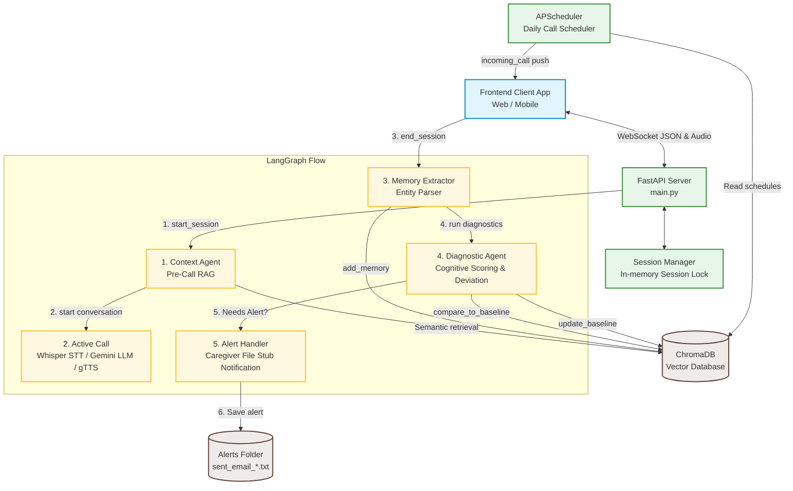

# Kinnect AI — Complete Project Description & Architecture

Kinnect AI is a voice-activated, agentic daily check-in and cognitive screening platform for elderly care. The system helps elderly individuals maintain connection and automatically monitors cognitive health indicators (like memory recall, confusion, and behavioral patterns) over time.

---

## 🏗️ System Architecture

The project consists of a **FastAPI backend** running an **in-process scheduler (APScheduler)** and exposing a **WebSocket connection server**. Conversational turns and post-call analyses are managed dynamically using a state-sharing **LangGraph workflow**.

---

## ⚙️ Core Modules

### 1. In-Memory Session & Connection Manager (`session_manager.py`, `connection_manager.py`)
Tracks active WebSocket connections and call states by `user_id`. It leverages `asyncio.Lock` to guarantee concurrency safety during read-modify-write state operations.

### 2. WebSocket Audio & Interaction Protocol (`handlers.py`, `audio_streamer.py`)
Provides real-time, low-latency audio processing:
*   **Speech-to-Text (STT):** Decodes incoming base64 WAV chunks and transcribes them using OpenAI Whisper.
*   **Text-to-Speech (TTS):** Generates responses with natural voice intonation via Google TTS (`gtts`), returning them as base64 MP3 chunks.

### 3. LangGraph Post-Call Workflow (`workflow.py`, `agents.py`)
Compiles a structured pipeline executing immediately after a call ends:
1.  **Memory Extraction Agent:** Scans the call transcript for new facts (appointments, health issues, preferences) and inserts them into ChromaDB.
2.  **Diagnostic Analyzer Agent:** Scores cognitive health (0–100) and detects anomalies. It checks current scores against the rolling historical baseline.
3.  **Alert Handler Agent:** Triggers caregiver warnings if the score falls below `60` or drops by `>20` points compared to the baseline.

### 4. Patient Cognitive Baseline Tracker (`baseline.py`)
Stores historical cognitive scores as custom metadata inside ChromaDB under the `baseline` entity type. It manages rolling averages of the patient's last 10 scores to track cognitive decline over time.

### 5. Call Scheduler (`scheduler.py`)
Runs in-process using APScheduler. It stores custom daily call times (e.g. 10:00 AM) in ChromaDB metadata. When triggered, it pushes an `incoming_call` frame over WebSockets to ring the client application.

### 6. Containerization (`Dockerfile`, `docker-compose.yml`)
Bridges all OS-level system libraries (like `ffmpeg`, `portaudio19`, and `libsndfile`) required for raw audio manipulation inside a single standalone Python image.
