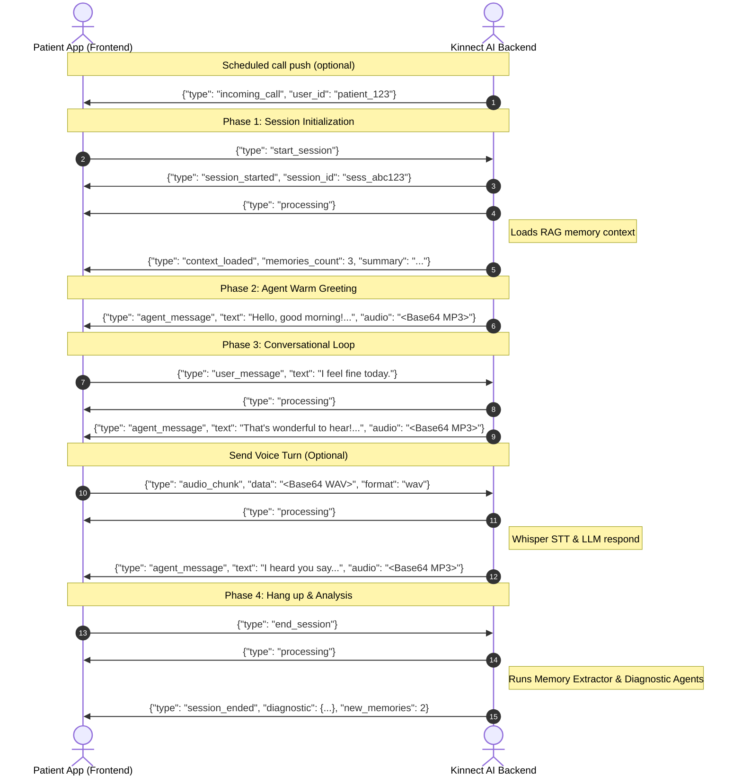

# Kinnect AI - Frontend Integration Guide

This guide is designed for frontend developers building client applications (Web, iOS, Android) that connect to the Kinnect AI Backend. It covers the REST endpoints, the WebSocket check-in protocol, audio formats, and visual interaction flow.

---

## 🚀 Connection & Server Info
*   **Base REST URL:** `http://localhost:8000`
*   **WebSocket Endpoint:** `ws://localhost:8000/ws/{user_id}` (No authentication required)
*   **Protocol Scheme:** JSON messages over WebSocket.

---

## 📡 REST API Reference

### 1. Health Check
Checks if the server is running and healthy.

*   **Endpoint:** `GET /health`
*   **Response (200 OK):**
    ```json
    {
      "status": "healthy",
      "timestamp": "2026-06-17T09:50:00.123456"
    }
    ```

### 2. System Status
Returns active system statistics and database size.

*   **Endpoint:** `GET /status`
*   **Response (200 OK):**
    ```json
    {
      "active_connections": 1,
      "connected_users": ["patient_001"],
      "chromadb_memories_count": 24,
      "environment": "development"
    }
    ```

---

## 🔄 WebSocket Protocol (`ws://localhost:8000/ws/{user_id}`)

The WebSocket protocol handles the complete daily check-in call session, including audio stream exchange, conversational logic, and post-call background agent execution.

### Session Lifecycle Flow Diagram



---

### 📥 Client-to-Server Messages (Sent by Frontend)

#### 1. Start Session
Initiates the RAG context loading, builds patient state, and triggers the warm greeting from the agent.
*   **Payload:**
    ```json
    {
      "type": "start_session"
    }
    ```

#### 2. User Message (Text Mode)
Sends a textual conversational turn.
*   **Payload:**
    ```json
    {
      "type": "user_message",
      "text": "I slept well last night but forgot to take my morning blood pressure pills."
    }
    ```

#### 3. Audio Chunk (Voice Mode)
Sends base64 encoded voice data. The backend transcribes this chunk using Whisper STT before responding.
*   **Payload:**
    ```json
    {
      "type": "audio_chunk",
      "data": "UklGRiZbAABXQVZFZm10IBAAAAABAAEAQB8AAEAfAAABAAgAZGF0YQ...",
      "format": "wav"
    }
    ```
    *   *Note: See [Audio Specifications](#🎙️-audio-specifications) section below for formatting details.*

#### 4. End Session (Hang Up)
Terminates the active call and instructs the backend to run post-call memory extraction and cognitive diagnostic analysis.
*   **Payload:**
    ```json
    {
      "type": "end_session"
    }
    ```

---

### 📤 Server-to-Client Messages (Received by Frontend)

#### 1. Session Started
Confirms the session initialization.
*   **Payload:**
    ```json
    {
      "type": "session_started",
      "session_id": "sess_3fbc7b129a"
    }
    ```

#### 2. Context Loaded
Sent after the Context Agent completes memory retrieval (RAG) and summarizes the patient history.
*   **Payload:**
    ```json
    {
      "type": "context_loaded",
      "memories_count": 5,
      "summary": "Patient has a son named David, is taking Metoprolol, and enjoys gardening."
    }
    ```

#### 3. Processing
Sent by the server to instruct the frontend to show a loading/thinking spinner (e.g. while Whisper STT is transcribing or Gemini LLM is generating a response).
*   **Payload:**
    ```json
    {
      "type": "processing"
    }
    ```

#### 4. Agent Message
Contains the text response and the synthesized spoken audio from the agent.
*   **Payload:**
    ```json
    {
      "type": "agent_message",
      "text": "Good morning! How are you feeling today?",
      "audio": "SUQzBAAAAAAAI1RTU0UAAAAPAAADTGFtZTMuMTAw..." // Base64 MP3
    }
    ```

#### 5. Session Ended
Returns the diagnostic and cognitive report details once the post-call graph completes execution.
*   **Payload:**
    ```json
    {
      "type": "session_ended",
      "diagnostic": {
        "cognitive_score": 85.0,
        "needs_alert": false,
        "summary": "The patient had a clear conversation today. Recalled son David and mentioned minor knee pain, but no memory confusion.",
        "anomalies": []
      },
      "new_memories": 1
    }
    ```

#### 6. Incoming Call (Scheduler Push)
Sent when the background cron scheduler triggers a call for this user. The frontend should display an incoming call overlay (similar to a phone call screen). The user can click "Accept" (which sends `start_session`) or "Decline" (closes socket).
*   **Payload:**
    ```json
    {
      "type": "incoming_call",
      "user_id": "patient_123",
      "timestamp": "2026-06-17T10:00:00.000000"
    }
    ```

#### 7. Error
Sent when an error occurs during processing.
*   **Payload:**
    ```json
    {
      "type": "error",
      "message": "Invalid message format"
    }
    ```

---

## 🎙️ Audio Specifications

### Client Recording (STT Input)
When sending speech via `audio_chunk` WebSocket messages, the audio must conform to:
*   **Format:** WAV (RIFF/WAVE container)
*   **Sample Rate:** 16,000 Hz (16kHz is expected by Whisper)
*   **Channels:** Mono (1 channel)
*   **Bit Depth:** 16-bit PCM
*   **Encoding:** Base64 encoded string

### Server Response (TTS Output)
Spoken replies from the agent are returned as a Base64-encoded string inside the `"audio"` field of `"agent_message"` payloads:
*   **Format:** MP3
*   **Audio Quality:** High-quality natural voice (synthesized via Google Text-to-Speech / gTTS)

---

## 🛡️ Error Handling Guidelines

1.  **Unexpected Disconnection:** If the WebSocket connection drops during a call, the backend automatically intercepts this and runs the post-call memory extraction and diagnostic workflow on the partial transcript. The frontend should attempt to reconnect or display a "Connection Lost - Saving Summary" status.
2.  **STT Transcription Failure:** If the user speaks but Whisper is unable to transcribe it (due to noise, silence, etc.), the backend returns an `agent_message` saying *"I'm sorry, I couldn't hear you clearly. Could you repeat that?"* along with the corresponding audio, instead of erroring out.
3.  **Invalid States:** Sending conversational text/audio without first triggering `start_session` will return a `{"type": "error", "message": "No active session..."}` frame. Ensure your app waits for the `session_started` message before enabling user inputs.
